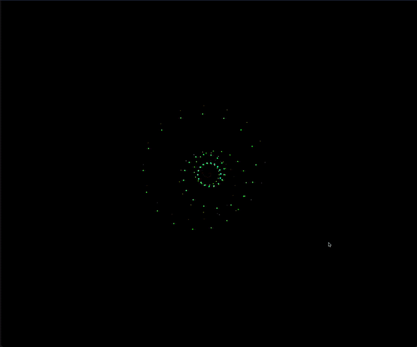

# Aizawa Attractor

This is an implemention of the Aizawa attractor using p5.js.

It uses the p5.easycam library to allow for the interactive control and it is included in the libraries folder so you should need to do nothing more than clone this project and open index.html in your favorite browser.

